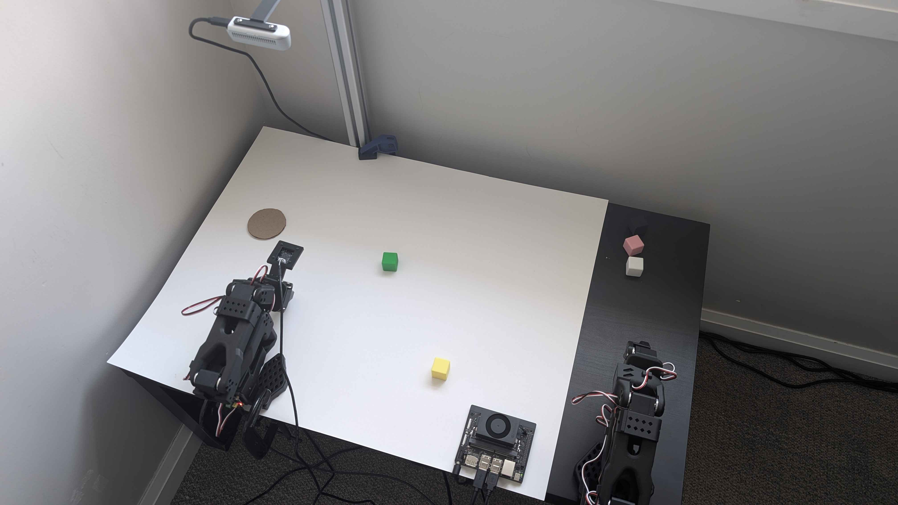

# 🦾 lerobot-cookbook

**End-to-end imitation learning on a real SO-101 arm:** teleoperate demos → train [ACT](https://github.com/huggingface/lerobot) / SmolVLA on a GPU → deploy to a headless Jetson that drives the arm in closed loop.

Portfolio of the build + my working command reference.



## What I built

- Working pick-and-place policy on a real SO-101 arm — demos → trained ACT → autonomous execution
- Multi-camera demo datasets (wrist + RealSense), 50–100 episodes/task, on the HuggingFace Hub
- Real 30 Hz closed-loop control on a Jetson Orin Nano (edge hardware)
- Split train/deploy: RTX 3060 Ti trains, Jetson runs; 21 platform gotchas solved ([99-gotchas.md](99-gotchas.md))
- Trained **+ deployed SmolVLA** (450M vision-language-action) on the same data — runs on the Jetson at ~17.5 Hz

## Demos

**ACT** — smooth, steady 30 Hz:

https://github.com/bjahoor/lerobot-cookbook/raw/main/act_demo.mp4

**SmolVLA** — ~17.5 Hz, moves in chunks (~1 s inference freeze → burst):

https://github.com/bjahoor/lerobot-cookbook/raw/main/smolvla_demo.mp4

## Pipeline

```
 ┌────────────┐     ┌────────────┐     ┌─────────────┐     ┌────────────┐
 │ TELEOPERATE│ ──► │   RECORD   │ ──► │    TRAIN    │ ──► │   DEPLOY   │
 │   demos    │     │ multi-cam  │     │ ACT/SmolVLA │     │ & run 30Hz │
 │  ·Jetson·  │     │  ·Jetson·  │     │  ·3060 Ti·  │     │  ·Jetson·  │
 └────────────┘     └────────────┘     └─────────────┘     └─────┬──────┘
        ▲                                                        │
        └────────────────────  more demos ◄  ────────────────────┘
```

## The stack

- **Compute**: NVIDIA Jetson Orin Nano "Super" (8 GB), JetPack 6.2.2, L4T R36.5.0, CUDA 12.6
- **Python**: system 3.10.12, native `pip --user` (no venv/conda)
- **LeRobot**: 0.4.4 (highest version supporting Python 3.10 — 0.5.0+ needs 3.12)
- **Arms**: SO-101 leader + follower (Feetech STS3215 servos)
- **Cameras**: USB wrist cam (MJPG) + Intel RealSense D435 overhead (color, addressed by serial)
- **Training rig**: separate PC with NVIDIA RTX 3060 Ti
- **Access**: Jetson runs headless, over Tailscale SSH

## The playbook

Numbered in the order you actually do them, start to finish.

**Jetson — setup & data collection**

| File | What |
|---|---|
| [00-install.md](00-install.md) | Native pip install of `lerobot[all]==0.4.4` on aarch64 + CUDA PyTorch fix |
| [01-calibration.md](01-calibration.md) | Motor ID assign + leader/follower calibration + elbow re-clocking trick |
| [02-teleop.md](02-teleop.md) | Leader → follower teleop one-liner |
| [03-camera-view.md](03-camera-view.md) | View a camera headless over Tailscale (ustreamer) to position/focus it |
| [04-recording.md](04-recording.md) | Dataset recording — 2 cameras at 640×480, h264 streaming encoding, resume |

**PC — training**

| File | What |
|---|---|
| [05-pc-install.md](05-pc-install.md) | PC install — lerobot 0.4.4 on Ubuntu 24.04 + Python 3.12, native (no venv), PEP 668 / `--break-system-packages` |
| [06-pc-training.md](06-pc-training.md) | Full PC training playbook — speed test, fresh train, resume to higher step count, SmolVLA finetuning, status, GPU monitor, Hub verify, log tricks, cleanup |
| [07-pc-tuning.md](07-pc-tuning.md) | Measured findings on the 3060 Ti — step rates, ACT vs SmolVLA, batch/workers sweet spot, batch-16 VRAM, power cap, convergence/overfitting math |

**Jetson — deployment**

| File | What |
|---|---|
| [08-policy-eval.md](08-policy-eval.md) | Running a trained policy on the real arm (ACT + SmolVLA; leader teleop for reset) |

**Reference**

| File | What |
|---|---|
| [09-tmux.md](09-tmux.md) | tmux essentials — detach/reattach so long runs survive disconnect |
| [99-gotchas.md](99-gotchas.md) | Everything that wasted hours and the actual fix |

## Notes

Working command recipes for THIS hardware — not a polished tutorial. If something here saves you (or future me) a frustrating evening of debugging, great.

Last updated: 2026-08-01
